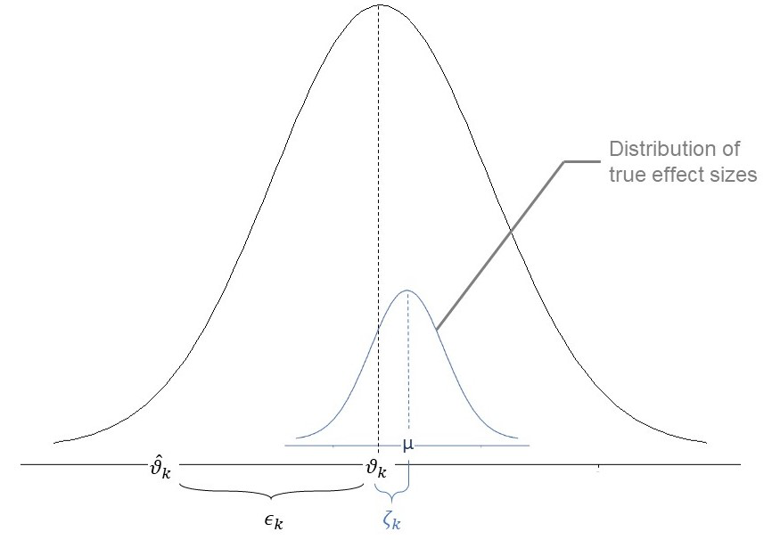
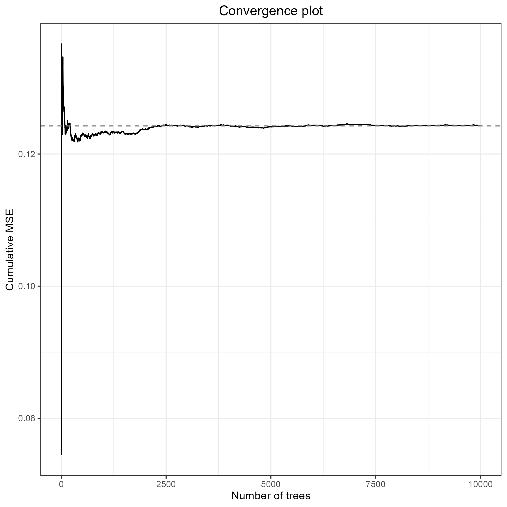

```{r, include = FALSE}
knitr::opts_chunk$set(
  collapse = TRUE,
  eval = (requireNamespace("mice", quietly = TRUE) & requireNamespace("metaforest", quietly = TRUE) & requireNamespace("bain", quietly = TRUE) & requireNamespace("metafor", quietly = TRUE) & knitr::is_html_output()),
  comment = "#>"
)
```


## Tutorial Requirements

1. Install R and then RStudio
    + Follow the instructions here: <https://posit.co/download/rstudio-desktop/>
2. Open RStudio.  
    Now, run the setup script for this workshop.  
    In the window labeled "Console", paste this code and press [Enter]: 

```
source("https://raw.githubusercontent.com/cjvanlissa/meta_workshop/refs/heads/master/check_function.R")
```

3. If you have your own data: after running the `source()` command above, you can use the function `check_data()`.
    + Load your own data into R as usual, and check if you can use it for the workshop exercises by running:
    + `check_data(your_data_object)`

## Meta-Analysis in R {#pool}

The essence of Meta-Analysis is **pooling your effect sizes** to get an overall effect size estimate of the studies.

When pooling effect sizes in Meta-Analysis, there are two basic approaches: the **Fixed-Effect-Model**, or the **Random-Effects-Model** [@borensteinIntroductionMetaAnalysis2009]. The fixed effect model assumes that one true effect size exists in the population; the random effects model assumes that the true effect varies (and is normally distributed).

Both of these models require an **effect size**, and a **dispersion (variance)** estimate for each study.

For these meta-analyses, we'll use the `metafor` package [@viechtbauerConductingMetaanalysesMetafor2010]. 
However, notice that we load a different package, `metaforest`.
The reason is that it contains the example data for this tutorial,
and it loads the `metafor` package in turn.

```{r, eval = FALSE, warning=FALSE,message=FALSE}
library(metaforest)
```

```{r, echo=FALSE,warning=FALSE,message=FALSE, include=FALSE}
library(knitr)
```

### Using Your Own Data

If you want, you can conduct the examples below with your own data. Note that the interactive questions won't work in this case (the correct answers are based on the `curry` data).

If you want to use your own data, you can use the function `check_data()` to help make sure that your data are suitable for the tutorial examples.
Install the function by running:

```{r eval = FALSE, echo = TRUE}
source("https://raw.githubusercontent.com/cjvanlissa/meta_workshop/refs/heads/master/check_function.R")
```

Then, apply the function to your data object by running `check_data(your_data_object)`. It will give helpful suggestions to make it easier to follow the tutorial with your own data:

```{r eval = TRUE, echo = FALSE}
message("✔ Looks like you're all set to do the workshop!")
```


```{r eval = FALSE, echo= TRUE}
df <- curry
check_data(df)
```
```{r eval = TRUE, echo= FALSE}
df <- structure(list(study_id = structure(c(1L, 1L, 2L, 3L, 4L, 5L, 
5L, 6L, 7L, 7L, 7L, 7L, 8L, 8L, 9L, 9L, 10L, 10L, 10L, 10L, 11L, 
11L, 12L, 13L, 14L, 15L, 16L, 16L, 16L, 17L, 17L, 18L, 19L, 19L, 
19L, 20L, 20L, 21L, 21L, 22L, 22L, 22L, 22L, 23L, 23L, 23L, 23L, 
23L, 23L, 24L, 24L, 25L, 25L, 26L, 26L, 27L), levels = c("Aknin, Barrington-Leigh, et al. (2013) Study 3", 
"Aknin, Broesch, et al. (2015) Study 1", "Aknin, Broesch, et al. (2015) Study 2", 
"Aknin, Dunn, et al. (2013) Study 3", "Aknin, Fleerackers, et al. (2014) ", 
"Aknin, Hamlin, et al. (2012) ", "Alden, & Trew (2013) ", "Anik, Aknin, et al. (2013) Study 1", 
"Buchanan, & Bardi (2010) ", "Chancellor, Margolis, et al. (2017)  ", 
"Donnelly, Grant, et al. (2017)  Study 1", "Donnelly, Grant, et al. (2017) Study 2b", 
"Dunn, Aknin, et al. (2008) Study 3", "Geenen, Hoheluchter, et al. (2014) ", 
"Hanniball & Aknin (2016, unpublished) ", "Layous, Kurtz, J, et al. (under review) Study 1", 
"Layous, Kurtz, J, et al. (under review) Study 2", "Layous, Lee, et al. (2013) ", 
"Layous, Nelson, et al. (2012) ", "Martela, & Ryan (2016) ", 
"Mongrain, Chin, et al. (2011) ", "Nelson, Della Porta, et al. (2015) ", 
"Nelson, Layous, et al. (2016) ", "O'Connell, O'Shea, et al. (2016) ", 
"Ouweneel, Le Blanc, et al. (2014) Study 2", "Trew, & Alden (2015) ", 
"Whillans, Dunn, et al. (2016) Study 2"), class = "factor"), 
    effect_id = 1:56, d = c(0.46, 0.13, 0.93, 0.3, 0.24, 0.38, 
    0.44, 0.46, 0.59, 0.16, 0.54, -0.42, -0.15, 0.49, 0.41, 0.62, 
    0, 0, 0, 0, 0.77, 0.85, 1.25, 0.67, 0.7, -0.46, 0.08, 0.2, 
    0.26, 0.3, 0.12, 0.18, -0.05, -0.12, 0.07, 0.55, 0.42, 0.08, 
    0.15, 0.23, 0.27, 0.09, 0.06, 0.3, 0.36, 0.15, 0.2, 0.16, 
    0.19, 0.02, 0.12, 0.27, 0.27, -0.05, -0.33, 0.19), vi = c(0.020529, 
    0.02004225, 0.170478846153846, 0.101125, 0.080576, 0.0342225418981152, 
    0.0344292645871908, 0.102645, 0.0503528019052956, 0.0484100308209583, 
    0.048206976744186, 0.0475372093023256, 0.0453499817301544, 
    0.0448654973649539, 0.0729294642857143, 0.0748607142857143, 
    0.0919117647058824, 0.0919117647058824, 0.0928030303030303, 
    0.0928030303030303, 0.0373841214864723, 0.0369597457627119, 
    0.0222387745820152, 0.0918358695652174, 0.0624264705882353, 
    0.0384537710411267, 0.0288014894916365, 0.028922352800989, 
    0.0290216333765286, 0.0181374017141807, 0.0179914557682348, 
    0.0143613243970822, 0.00961838942307692, 0.00963269230769231, 
    0.00962127403846154, 0.0552114200943535, 0.0543818148311956, 
    0.00844556962025316, 0.00846255274261603, 0.0369399082568807, 
    0.0370316513761468, 0.0364004545454545, 0.03638, 0.0129494889715091, 
    0.0130054211748989, 0.0128541499884583, 0.0128788675025826, 
    0.0128585285195317, 0.0128733590280063, 0.119052619047619, 
    0.0680943841287198, 0.0824105442176871, 0.0824105442176871, 
    0.0507218561609334, 0.0528751645373597, 0.0550520650787774
    ), n1i = c(100, 100, 13, 20, 25, 60, 60, 20, 43, 43, 43, 
    43, 41, 44, 28, 28, 16, 16, 16, 16, 59, 59, 107, 23, 34, 
    51, 70, 70, 70, 178, 178, 213, 208, 208, 208, 34, 34, 237, 
    237, 54.5, 54.5, 55, 55, 238, 238, 238, 238, 238, 238, 28, 
    28, 25, 25, 38, 36, 36), n2c = c(100, 100, 13, 20, 25, 59, 
    59, 20, 40, 40, 43, 43, 48, 48, 28, 28, 34, 34, 33, 33, 56, 
    59, 108, 23, 34, 56, 69, 69, 69, 81, 81, 104, 208, 208, 208, 
    42, 42, 237, 237, 54.5, 54.5, 55, 55, 116, 116, 116, 116, 
    116, 116, 12, 31, 24, 24, 41, 41, 37), sex = c(38L, 38L, 
    42L, 70L, 34L, 41L, 41L, 55L, 28L, 28L, 28L, 28L, 41L, 41L, 
    26L, 26L, 27L, 27L, 27L, 27L, 52L, 52L, 50L, 26L, 21L, 43L, 
    16L, 16L, 16L, 19L, 19L, 38L, 38L, 38L, 38L, 36L, 36L, 16L, 
    16L, 53L, 53L, 53L, 53L, 40L, 40L, 40L, 40L, 40L, 40L, 43L, 
    43L, 16L, 16L, 26L, 26L, 50L), age = c(21, 21, 45, 3, 21, 
    19.9, 19.9, 1.9, 19.56, 19.56, 19.56, 19.56, 37.28, 37.28, 
    38, 38, 35.6, 35.6, 35.6, 35.6, 22.57, 22.57, 37.77, 20, 
    20, 19.37, 18.55, 18.55, 18.55, 18.93, 18.93, 20, 10.6, 10.6, 
    10.6, 20.4, 20.4, 33.63, 33.63, 19.98, 19.98, 19.98, 19.98, 
    29.95, 29.95, 29.95, 29.95, 29.95, 29.95, 34.17, 34.17, 20.88, 
    20.88, 20.47, 20.47, 72.02), location = structure(c(3L, 3L, 
    10L, 10L, 2L, 8L, 8L, 2L, 2L, 2L, 2L, 2L, 1L, 1L, 7L, 7L, 
    6L, 6L, 6L, 6L, 8L, 8L, 8L, 2L, 4L, 2L, 8L, 8L, 8L, 8L, 8L, 
    9L, 2L, 2L, 2L, 8L, 8L, 2L, 2L, 9L, 9L, 9L, 9L, 8L, 8L, 8L, 
    8L, 8L, 8L, 8L, 8L, 5L, 5L, 2L, 2L, 8L), levels = c("Australia", 
    "Canada", "Canada / South Africa", "Germany", "Netherlands", 
    "Spain", "UK?", "USA", "USA/Korea", "Vanuatu"), class = "factor"), 
    donor = structure(c(3L, 3L, 3L, 3L, 3L, 3L, 3L, 3L, 2L, 2L, 
    2L, 2L, 3L, 3L, 3L, 3L, 3L, 3L, 3L, 3L, 3L, 3L, 3L, 3L, 3L, 
    3L, 3L, 3L, 3L, 3L, 3L, 3L, 3L, 3L, 3L, 3L, 3L, 3L, 3L, 3L, 
    3L, 3L, 3L, 3L, 3L, 3L, 3L, 3L, 3L, 3L, 3L, 3L, 3L, 2L, 2L, 
    1L), levels = c("Hypertense", "Socially Anxious", "Typical"
    ), class = "factor"), donorcode = structure(c(2L, 2L, 2L, 
    2L, 2L, 2L, 2L, 2L, 1L, 1L, 1L, 1L, 2L, 2L, 2L, 2L, 2L, 2L, 
    2L, 2L, 2L, 2L, 2L, 2L, 2L, 2L, 2L, 2L, 2L, 2L, 2L, 2L, 2L, 
    2L, 2L, 2L, 2L, 2L, 2L, 2L, 2L, 2L, 2L, 2L, 2L, 2L, 2L, 2L, 
    2L, 2L, 2L, 2L, 2L, 1L, 1L, 2L), levels = c("Anxious", "Typical"
    ), class = "factor"), interventioniv = structure(c(5L, 5L, 
    5L, 3L, 5L, 5L, 5L, 3L, 1L, 1L, 1L, 1L, 6L, 7L, 1L, 1L, 1L, 
    1L, 1L, 1L, 8L, 8L, 8L, 5L, 5L, 4L, 1L, 1L, 1L, 1L, 1L, 1L, 
    1L, 1L, 1L, 2L, 2L, 1L, 1L, 1L, 1L, 1L, 1L, 1L, 1L, 1L, 1L, 
    1L, 1L, 1L, 1L, 1L, 1L, 1L, 1L, 5L), levels = c("AK", "Benevolence", 
    "Donate own sweets", "Helping behavior: mapping out course schedule", 
    "Prosocial Purchase", "Prosocial Purchase ($25)", "Prosocial Purchase ($50)", 
    "Social recycling"), class = "factor"), interventioncode = structure(c(3L, 
    3L, 3L, 2L, 3L, 3L, 3L, 2L, 1L, 1L, 1L, 1L, 3L, 3L, 1L, 1L, 
    1L, 1L, 1L, 1L, 2L, 2L, 2L, 3L, 3L, 2L, 1L, 1L, 1L, 1L, 1L, 
    1L, 1L, 1L, 1L, 2L, 2L, 1L, 1L, 1L, 1L, 1L, 1L, 1L, 1L, 1L, 
    1L, 1L, 1L, 1L, 1L, 1L, 1L, 1L, 1L, 3L), levels = c("Acts of Kindness", 
    "Other", "Prosocial Spending"), class = "factor"), control = structure(c(12L, 
    12L, 12L, 2L, 12L, 12L, 12L, 2L, 1L, 1L, 4L, 4L, 11L, 11L, 
    9L, 10L, 13L, 13L, 11L, 11L, 22L, 17L, 21L, 12L, 12L, 3L, 
    20L, 20L, 20L, 6L, 6L, 18L, 23L, 23L, 23L, 8L, 8L, 7L, 7L, 
    24L, 24L, 24L, 24L, 19L, 19L, 19L, 14L, 15L, 14L, 5L, 14L, 
    8L, 8L, 16L, 5L, 12L), levels = c("BE", "Donate other sweets", 
    "Helping self", "LD", "List activities", "Make self happier", 
    "Memory", "Neutral Activity", "New Acts", "No Acts", "None", 
    "Personal Purchase", "Receiver", "Self", "Self ", "Social Exposure", 
    "Take item", "Track Locations", "Track activities", "Track daily activity", 
    "Trash", "Trash/Recycling", "Whereabouts", "Work Activity"
    ), class = "factor"), controlcode = structure(c(3L, 3L, 3L, 
    1L, 3L, 3L, 3L, 1L, 1L, 1L, 1L, 1L, 2L, 2L, 1L, 2L, 3L, 3L, 
    2L, 2L, 1L, 3L, 1L, 3L, 3L, 3L, 1L, 1L, 1L, 3L, 3L, 1L, 1L, 
    1L, 1L, 1L, 1L, 1L, 1L, 1L, 1L, 1L, 1L, 1L, 1L, 1L, 3L, 3L, 
    3L, 1L, 3L, 1L, 1L, 1L, 1L, 3L), levels = c("Neutral Activity", 
    "Nothing", "Self Help"), class = "factor"), recipients = structure(c(1L, 
    1L, 7L, 11L, 13L, 1L, 1L, 11L, 2L, 2L, 2L, 2L, 4L, 4L, 2L, 
    2L, 5L, 5L, 5L, 5L, 15L, 15L, 15L, 3L, 8L, 6L, 14L, 14L, 
    14L, 9L, 9L, 2L, 2L, 2L, 2L, 4L, 4L, 2L, 2L, 2L, 2L, 2L, 
    2L, 10L, 10L, 10L, 10L, 10L, 10L, 12L, 12L, 2L, 2L, 2L, 2L, 
    2L), levels = c("Anonymous Sick Children", "Anyone", "Anyone / Charity", 
    "Charity", "Co-Worker", "Colleague", "Family / Friends", 
    "Friends", "Other/One", "Other/World", "Puppet", "Social Network", 
    "Someone", "Someone known", "Unknown lab workers"), class = "factor"), 
    outcomedv = structure(c(6L, 14L, 6L, 16L, 17L, 7L, 5L, 16L, 
    6L, NA, 6L, NA, 7L, 7L, 14L, 14L, 12L, 14L, 12L, 14L, 3L, 
    3L, 6L, 3L, 7L, 7L, 12L, 17L, 2L, 12L, 17L, 17L, 13L, 8L, 
    15L, 6L, NA, 11L, 1L, 12L, 14L, 9L, 4L, 9L, 4L, 10L, 9L, 
    4L, 10L, 12L, 12L, 9L, 4L, 6L, 6L, 17L), levels = c("CES-D", 
    "EWB", "H", "NE", "ORH", "PA", "PANAS", "PAc", "PE", "PF", 
    "SHI", "SHS", "SHSc", "SWLS", "SWLSc", "Smiling", "WB"), class = "factor"), 
    outcomecode = structure(c(4L, 2L, 4L, 3L, 3L, 4L, 3L, 3L, 
    4L, 4L, 4L, 4L, 4L, 4L, 2L, 2L, 1L, 2L, 1L, 2L, 1L, 1L, 4L, 
    1L, 4L, 4L, 1L, 3L, 3L, 1L, 3L, 3L, 1L, 4L, 2L, 4L, 4L, 1L, 
    3L, 1L, 2L, 4L, 4L, 4L, 4L, 3L, 4L, 4L, 3L, 1L, 1L, 4L, 4L, 
    4L, 4L, 3L), levels = c("Happiness", "Life Satisfaction", 
    "Other", "PN Affect"), class = "factor")), class = "data.frame", row.names = c(NA, 
-56L))

message("There is no column named 'yi' in your data. If you have an effect size column, it will be easier to do the tutorial if you rename it, using syntax like this:
  
  names(df)[which(names(df) == 'youreffectsize')] <- 'yi'
  
  If you do not yet have an effect size column, you may need to compute it first. Run ?metafor::escalc to see the help for this function.")
```


Note that the message suggests that we rename the effect size column, which is called `d` in the `curry` dataset, to `yi`. Let's do that:

```{r}
names(df)[which(names(df) == 'd')] <- 'yi'
```

### Using Different Demo Data

If you do not have your own data but are up for a challenge,
you can use a different demo dataset to complete the tutorial.
Two suggestions are:

```
metaforest::fukkink_lont
pema::bonapersona
```

## Fixed Effect Model {#fixedef}

**The idea behind the fixed-effects-model**

The fixed-effects-model assumes that all observed effect sizes stem from a single *true* population effect [@borensteinIntroductionMetaAnalysis2009]. To calculate the overall effect, we therefore average all effect sizes, but give studies with greater precision a higher weight. Precision relates to the fact that studies with a smaller **Standard Error** provide more accurate estimates of the true population effect.

For this weighing, we use the **inverse of the variance** $1/\hat\sigma^2_k$ of each study $k$. We then calculate a weighted average of all studies, our fixed effect size estimator $\hat\theta_F$:

$$
\begin{equation}
\hat\theta_F = \frac{\sum\limits_{k=1}^K \hat\theta_k/ \hat\sigma^2_k}{\sum\limits_{k=1}^K 1/\hat\sigma^2_k}
\end{equation}
$$

These examples assume you already have a dataset with the **calucated effects and SE** for each study. The `curry` data set, inside the `metaforest` package, will do.
This dataset already contains the effect sizes and their variances, so we can directly use the `rma` function. 


### Fixed-effects Model with `rma`

The `rma()` function has many arguments, all of which you can accessed by typing `?rma` in your console once the `metafor` package is loaded, or selecting the function and pressing F1.
  
**Here is a table with the most important arguments for our code:**

```{r,echo=FALSE}
i<-c("yi","vi","method")
ii<-c("A vector with the effect sizes",
      "A vector with the sampling variances",
      "A character string, indicating what type of meta-analysis to run. FE runs a fixed-effect model")
ms<-data.frame(i,ii)
names<-c("Argument", "Function")
colnames(ms)<-names
kable(ms)
```

Let's conduct our first fixed-effects-model Meta-Analysis. We we will give the results of this analysis the simple name `m`.

```{r, eval = FALSE}
m <- rma(yi = df$yi,     # The yi-column of the df, which contains Cohen's d
         vi = df$vi,    # The vi-column of the df, which contains the variances
         method = "FE") # Run a fixed-effect model
m
```
```{r eval = TRUE, echo = FALSE}
cat(c("Fixed-Effects Model (k = 56)", "", "I^2 (total heterogeneity / total variability):   64.95%", 
"H^2 (total variability / sampling variability):  2.85", "", 
"Test for Heterogeneity:", "Q(df = 55) = 156.9109, p-val < .0001", 
"", "Model Results:", "", "estimate      se    zval    pval   ci.lb   ci.ub      ", 
"  0.2059  0.0219  9.4135  <.0001  0.1630  0.2487  *** ", "", 
"---", "Signif. codes:  0 ‘***’ 0.001 ‘**’ 0.01 ‘*’ 0.05 ‘.’ 0.1 ‘ ’ 1"
), sep = "\n")
```


We now see a summary of the results of our Meta-Analysis, including

* The total **number of included studies** (k)
* The **overall effect**, its confidence interval and p-value
* The *Q*-test of heterogeneity

```{r results='asis', echo=FALSE}
pema:::quizz(
  "How big is the overall effect?" = c(0.206, .01),
  "True or false: A significant proportion of the variability in effect sizes is attributable to heterogeneity, rather than sampling error." = TRUE,
  "What can you say about the heterogeneity of the population effect?" = c(answer = "It is assumed to be zero", "It is large, I2 = 64.95%", "It is significant, Q(55) = 156,91, p < .0001", "Can't say anything based on this output"),
  title = "Formative Assessment")
```

## Random-Effects-Model {#random}

We can only use the fixed-effect-model when we can assume that **all included studies tap into one true effect size**. In practice this is hardly ever the case: interventions may vary in certain characteristics, the sample used in each study might be slightly different, or its methods. If we can assume that there are many small, random, uncorrelated variations in true effect sizes, then a more appropriate assumption in these cases might be that the true effect size follows a normal distribution.


**The Idea behind the Random-Effects-Model**

In the Random-Effects-Model, we want to account for our assumption that the population effect size is normally distributed [@schwarzerMetaAnalysis2015]. 

The fixed-effect-model assumes that when the observed effect size $\hat\theta_k$ of an individual study $k$ deviates from the true effect size $\theta_F$, the only reason for this is that the estimate is burdened by (sampling) error $\epsilon_k$.

$$\hat\theta_k = \theta_F + \epsilon_k$$


While the random-effects-model assumes that, in addition, there is **a second source of error** $\zeta_k$.This second source of error is introduced by the fact that even the true effect size $\theta_k$ of our study $k$ is also only part of an over-arching distribution of true effect sizes with the mean $\mu$ [@borensteinIntroductionMetaAnalysis2009]. 

```{r, echo=FALSE, out.width="70%",fig.align='center', fig.cap="An illustration of  parameters of the random-effects-model", fig.alt="An illustration of  parameters of the random-effects-model"}

```


The formula for the random-effects-model therefore looks like this:

$$\hat\theta_k = \mu + \epsilon_k + \zeta_k$$

When calculating a random-effects-model meta-analysis, where therefore also have to take the error $\zeta_k$ into account. To do this, we have to **estimate the variance of the distribution of true effect sizes**, which is denoted by $\tau^{2}$, or *tau^2^*. There are several estimators for $\tau^{2}$, all of which are implemented in `metafor`.


## Random-Effects Model with `rma`

We can re-use our code from the fixed-effects-model and simply remove the `method = "FE"` argument to conduct a random-effects analysis with the default REML estimator for $\tau^2$:

```{r eval = FALSE}
m_re <- rma(yi = df$yi,     # The yi-column of the df, which contains Cohen's d
            vi = df$vi)    # The vi-column of the df, which contains the variances
m_re
```

```{r eval = TRUE, echo = FALSE}
cat(c("", "Random-Effects Model (k = 56; tau^2 estimator: REML)", 
"", "tau^2 (estimated amount of total heterogeneity): 0.0570 (SE = 0.0176)", 
"tau (square root of estimated tau^2 value):      0.2388", "I^2 (total heterogeneity / total variability):   67.77%", 
"H^2 (total variability / sampling variability):  3.10", "", 
"Test for Heterogeneity:", "Q(df = 55) = 156.9109, p-val < .0001", 
"", "Model Results:", "", "estimate      se    zval    pval   ci.lb   ci.ub      ", 
"  0.2393  0.0414  5.7805  <.0001  0.1581  0.3204  *** ", "", 
"---", "Signif. codes:  0 ‘***’ 0.001 ‘**’ 0.01 ‘*’ 0.05 ‘.’ 0.1 ‘ ’ 1"
)
, sep = "\n")
```

```{r results='asis', echo=FALSE}
pema:::quizz(
  "How big is the overall effect?" = c(0.24, .01),
  "What is the estimated heterogeneity?" = c(0.06, .01),
  "What can you say about the the expected value of the population effect in the random-effects model, compared to the previous fixed-effect model?" = c(answer = "It is larger", "It is smaller", "It is about the same", "Can't say anything based on this output"),
  title = "Formative Assessment")

cat("This is caused by the fact that random-effects models assign more equal weight to all studies, including small ones, which tend to be more biased.")
```

# Meta-Regression {#metareg}

**The idea behind meta-regression**

In a conventional regression, we specify a model predicting the dependent variable $y$, across $_i$ participants, based on their values on $p$ predictor variables, $x_{i1} \dots x_{ip}$. The residual error is referred to as $\epsilon_i$. A standard regression equation therefore looks like this:

$$y_i=\beta_0 + \beta_1x_{1i} + ...+\beta_px_{pi} + \epsilon_i$$

In a meta-regression, we want to estimate the **effect size** $\theta$ of several studies $_k$, as a function of between-studies moderators. There are two sources of heterogeneity: sampling error, $\epsilon_k$, and between-studies heterogeneity, $\zeta_k$ so our regression looks like this:

$$\theta_k = \beta_0 + \beta_1x_{1k} + ... + \beta_px_{pk} + \epsilon_k + \zeta_k$$

You might have seen that when estimating the effect size $\theta_k$ of a study $k$ in our regression model, there are two **extra terms in the equation**, $\epsilon_k$ and $\zeta_k$. The same terms can also be found in the equation for the random-effects model. The two terms signify two types of **independent errors** which cause our regression prediction to be **imperfect**. The first one, $\epsilon_k$, is the sampling error through which the effect size of the study deviates from its "true" effect. The second one, $\zeta_k$, denotes that even the true effect size of the study is only sampled from **an overarching distribution of effect sizes**.

As the equation above has includes **fixed effects** (the $\beta$ coefficients) as well as **random effects** ($\zeta_k$), the model used in meta-regression is often called **a mixed-effects-model**. 


### Testing Moderators' Significance

To evaluate the **statistical significance of a predictor**, we conduct a **t-test** (or Z-test) of its $\beta$-weight.

$$ t=\frac{\beta}{SE_{\beta}}$$

Which provides a $p$-value telling us if a variable significantly predicts effect size differences in our regression model.


### Assessing Meta-Regression Model Fit

In conventional regression, $R^2$ is commonly used to quantify the percentage of variance in the data explained by the model, as a percentage of total variance (0-100%). As this measure is commonly used, and many researchers know how to to interpret it, we can also calculate a $R^2$ analog for meta-regression using this formula:

$$R_2=\frac{\hat\tau^2_{REM}-\hat\tau^2_{MEM}}{\hat\tau^2_{REM}}$$

Where $\hat\tau^2_{REM}$ is the estimated total heterogenetiy based on the random-effects-model and $\hat\tau^2_{REM}$ the total heterogeneity of our mixed-effects regression model.

NOTE however, that $R^2$ refers to variance explained in the observed data.
In linear regression, the more predictors you add, the better your model will explain the observed data.
But this can decrease the generalizability of you model, through a process called **overfitting**: You're capturing noise in your dataset, not true effects that exist in the real world.
In meta-regression, because the estimate of heterogeneity may differ,
we may not actually see the $R^2$ increasing with more predictors - but because the samples are often small, be very mindful of overfitting nonetheless.


## Meta-regression in R

Meta-regressions can be conducted in R using the `rma` function in `metafor`. First, let's conduct a regression with a single categorical predictor, `donorcode`, which has two levels: `Anxious` and `Typical`:

```{r eval = FALSE}
m_cat <- rma(yi ~ donorcode, vi = vi, data = df)
m_cat
```
```{r eval = TRUE, echo = FALSE}
cat(c("", "Mixed-Effects Model (k = 56; tau^2 estimator: REML)", 
"", "tau^2 (estimated amount of residual heterogeneity):     0.0567 (SE = 0.0177)", 
"tau (square root of estimated tau^2 value):             0.2382", 
"I^2 (residual heterogeneity / unaccounted variability): 67.81%", 
"H^2 (unaccounted variability / sampling variability):   3.11", 
"R^2 (amount of heterogeneity accounted for):            0.49%", 
"", "Test for Residual Heterogeneity:", "QE(df = 54) = 155.0054, p-val < .0001", 
"", "Test of Moderators (coefficient 2):", "QM(df = 1) = 1.5257, p-val = 0.2168", 
"", "Model Results:", "", "                  estimate      se    zval    pval    ci.lb   ci.ub    ", 
"intrcpt             0.0829  0.1332  0.6222  0.5338  -0.1781  0.3439    ", 
"donorcodeTypical    0.1730  0.1401  1.2352  0.2168  -0.1015  0.4476    ", 
"", "---", "Signif. codes:  0 ‘***’ 0.001 ‘**’ 0.01 ‘*’ 0.05 ‘.’ 0.1 ‘ ’ 1"
), sep = "\n")
```

By default, `metafor::rma()` will recode `factor` variables to make one group the reference category and create dummies for all other groups.
The syntax above created a binary indicator variable (a dummy variable) for people who fall in the `Typical` category.
It then estimated the model intercept - which is the population effect size in the `Anxious` category, which serves as reference category here,
and the effect of the `donorcodeTypical` dummy, which tells us the difference between the two groups' population effects.

```{r results='asis', echo=FALSE}
pema:::quizz(
"What is the expected population effect size in the Typical group?" = c(0.17, .01),
"What is the expected population effect size in the Anxious group?" = c(0.255888, .01),
"True or false: There is a significant difference between the two groups." = FALSE, title = "Formative Assessment")
```


### Continuous Predictors

Imagine you want to check if the **proportion of male participants** is associated with effect size. The variable `sex` contains this information. You can use this predictor in a meta-regression:

```{r,echo=FALSE}
# load("Meta_Analysis_Data.RData")
# madata<-Meta_Analysis_Data
# madata$pub_year<-c(2001,2002,2011,2013,2013,2014,1999,2018,2001,2002,2011,2013,2013,2014,1999,2018,2003,2005)
# madata$pub_year<-as.numeric(madata$pub_year)
# m.pubyear<-metagen(TE,seTE,studlab = paste(Author),comb.fixed = FALSE,data=madata)
```

```{r eval = FALSE}
m_reg <- rma(yi ~sex,
             vi = vi,
             data = df)
m_reg
```
```{r eval = TRUE, echo = FALSE}
cat(c("", "Mixed-Effects Model (k = 56; tau^2 estimator: REML)", 
"", "tau^2 (estimated amount of residual heterogeneity):     0.0544 (SE = 0.0173)", 
"tau (square root of estimated tau^2 value):             0.2333", 
"I^2 (residual heterogeneity / unaccounted variability): 66.50%", 
"H^2 (unaccounted variability / sampling variability):   2.98", 
"R^2 (amount of heterogeneity accounted for):            4.53%", 
"", "Test for Residual Heterogeneity:", "QE(df = 54) = 149.5878, p-val < .0001", 
"", "Test of Moderators (coefficient 2):", "QM(df = 1) = 2.1607, p-val = 0.1416", 
"", "Model Results:", "", "         estimate      se    zval    pval    ci.lb   ci.ub    ", 
"intrcpt    0.0648  0.1253  0.5168  0.6053  -0.1808  0.3104    ", 
"sex        0.0050  0.0034  1.4699  0.1416  -0.0017  0.0116    ", 
"", "---", "Signif. codes:  0 ‘***’ 0.001 ‘**’ 0.01 ‘*’ 0.05 ‘.’ 0.1 ‘ ’ 1"
), sep = "\n")
```


```{r results='asis', echo=FALSE}
pema:::quizz(
"True or false: There is a significant effect of sex." = FALSE,
"How to interpret the effect of sex?" = c(answer = "1% increase in male participants is associated with .005 increase of the effect size", "The difference between men and women is .005", "There is no effect of sex", "Can't say based on this output"), title = "Formative Assessment")
```

### Multiple Meta-Regression


Previously, we only considered the scenario in which we use **one predictor** $\beta_1x_1$ in our meta-regression.
When we add more than one predictor, we're using **multiple meta-regression**. In multiple meta-regression we use several moderators (variables) to predict the outcome (effect sizes). When we look back at the **general meta-regression** formula we defined before, we actually see that the formula already provides us with this feature through the $\beta_nx_{pk}$ part. Here, the parameter $p$ denotes that we can include $p$ more predictors/variables into our meta-regression, making it a multiple meta-regression.

We could include both predictors from the previous exercises in a mutliple meta-regression as follows:

```{r eval = FALSE}
m_multi <- rma(yi ~ sex + donorcode,
               vi = vi,
               data = df)
m_multi
```

```{r eval = TRUE, echo = FALSE}
cat(c("", "Mixed-Effects Model (k = 56; tau^2 estimator: REML)", 
"", "tau^2 (estimated amount of residual heterogeneity):     0.0551 (SE = 0.0175)", 
"tau (square root of estimated tau^2 value):             0.2347", 
"I^2 (residual heterogeneity / unaccounted variability): 66.89%", 
"H^2 (unaccounted variability / sampling variability):   3.02", 
"R^2 (amount of heterogeneity accounted for):            3.42%", 
"", "Test for Residual Heterogeneity:", "QE(df = 53) = 148.6166, p-val < .0001", 
"", "Test of Moderators (coefficients 2:3):", "QM(df = 2) = 3.0602, p-val = 0.2165", 
"", "Model Results:", "", "                  estimate      se     zval    pval    ci.lb   ci.ub    ", 
"intrcpt            -0.0337  0.1626  -0.2074  0.8357  -0.3523  0.2849    ", 
"sex                 0.0043  0.0035   1.2310  0.2183  -0.0025  0.0111    ", 
"donorcodeTypical    0.1361  0.1421   0.9579  0.3381  -0.1424  0.4146    ", 
"", "---", "Signif. codes:  0 ‘***’ 0.001 ‘**’ 0.01 ‘*’ 0.05 ‘.’ 0.1 ‘ ’ 1"
), sep = "\n")
```

Now, let's create a model that includes *all* potential moderators of the effect size:

```{r eval = FALSE}
mods <- c("sex", "age", "location", "donorcode", "interventioncode", "controlcode", "recipients", "outcomecode")

res_multi2 <- rma(as.formula(paste("yi ~", paste(mods, collapse = "+"))), vi = vi, data = df)

res_multi2
```

```{r eval = TRUE, echo = FALSE}
mods <- c("sex", "age", "location", "donorcode", "interventioncode", "controlcode", "recipients", "outcomecode")
cat(c("", "Mixed-Effects Model (k = 56; tau^2 estimator: REML)", 
"", "tau^2 (estimated amount of residual heterogeneity):     0.0038 (SE = 0.0076)", 
"tau (square root of estimated tau^2 value):             0.0618", 
"I^2 (residual heterogeneity / unaccounted variability): 12.55%", 
"H^2 (unaccounted variability / sampling variability):   1.14", 
"R^2 (amount of heterogeneity accounted for):            93.30%", 
"", "Test for Residual Heterogeneity:", "QE(df = 26) = 34.1905, p-val = 0.1303", 
"", "Test of Moderators (coefficients 2:30):", "QM(df = 29) = 105.3506, p-val < .0001", 
"", "Model Results:", "", "", "---", "Signif. codes:  0 ‘***’ 0.001 ‘**’ 0.01 ‘*’ 0.05 ‘.’ 0.1 ‘ ’ 1"
), sep = "\n")
```

```{r results='asis', echo=FALSE}
pema:::quizz(
"What is the number of studies included in the second multiple meta-regression (with all predictors)?" = 56L,
"What is the number of parameters of the second multiple meta-regression (with all predictors)?" = 30L,
"The $R^2$ of the second multiple meta-regression model is 93.30%. How can we interpret this?" = c(answer = "With caution; the model is likely overfit.", "As a large effect; the moderators explain most of the heterogeneity.", "As a large effect; there must be several significant moderators.", "Can't say based on this output"), title = "Formative Assessment")
```

## Optional: Pitfalls of Meta-Regression

Skip this section if you are pressed for time.

### Multicollinearity

When performing the analysis above, we saw a warning message:


```{r, echo = FALSE, eval = TRUE}
warning("Redundant predictors dropped from the model.")
```

This warning tells us that some of the moderators conveyed exactly the same information,
and therefore, it's not possible to include both in the same model.

For example, look at the following subset of the data. Imagine that this would be our entire dataset:

```{r}
df[c(5, 24, 28, 46), c("age", "location", "interventioncode", "controlcode", "outcomecode")]
```

Note that the variable `age` has unique values for each study, but the first two and second two studies are completely identical in the variables `location`, `interventioncode`, and `controlcode`.
If this was our dataset, it would thus not be possible to determine a unique effect for any of these three variables (because they overlap completely).
This is an example of (multi)colinearity.
Even more worrying: the column `outcomecode` almost has the same value for each study.
If it did, then this column would be redundant with the model's intercept! It would no longer be a variable, but a constant.
As it stands, only one study is distinct in `outcomecode`.
If we add a dummy for this variable - that dummy uniquely identifies that one study (which means the model will perfectly reproduce its value)!

### Overfitting

To better understand the risks of (multiple) meta-regression models, we have to understand the concept of **overfitting**. Overfitting occurs when we build a statistical model which fits the data **too closely**. In essence, this means that we build a statistical model which can predict the data at hand very well, but performs bad at predicting future data it has never seen before. This happens if our model assumes that some variation in our data **stems from a true "signal" in our data, when in fact we only model random noise** [@hastieElementsStatisticalLearning2009]. As a result, our statistical model produces **false positive results**: it sees relationships where there are none.

```{r echo = FALSE, out.width="70%", fig.cap="Illustration of an overfitted model vs. model with a good fit"}
knitr::include_graphics("./include/overfitting.png")
```

Regression methods, which usually utilize minimization or maximization procedures such as Ordinary Least Squares or Maximum Likelihood estimation, can be prone to overfitting [@hastieElementsStatisticalLearning2009]. Unfortunately, the risk of building a **non-robust model, which produces false-positive results**, is **even higher** once we go from conventional regression to **meta-regression** [@higginsControllingRiskSpurious2004]. There are several reasons for this:

1.  In Meta-Regression, our **sample is often small**, as we can only use the synthesized data of all analyzed studies $k$.
2.  As our meta-analysis aims to be a **comprehensive overview of all evidence**, we have no **additional data** on which we can "test" how well our regression model can predict high or low effect sizes.
3.  In meta-regressions, we have to deal with the potential presence of effect size heterogeneity. Imagine a case in which we have two studies with different effect sizes and non-overlapping confidence intervals. Every variable which has different values for the different studies might be a potential explanation for effect size difference we find, while it seems straightforward that **most of such explanations are spurious** [@higginsControllingRiskSpurious2004].
4.  Meta-regression as such, and multiple meta-regression in particular, make it very easy to **"play around" with predictors**. We can test numerous meta-regression models, include many more predictors or remove them in an attempt to explain the heterogeneity in our data. Such an approach is of course tempting, and often found in practice, because we, as meta-analysts, want to find a significant model which explains why effect sizes differ [@higginsStatisticalHeterogeneitySystematic2002]. However, such behavior **massively increases the risk of spurious findings** [@higginsControllingRiskSpurious2004], because we can change parts of our model indefinitely until we find a significant model, which is then very likely to be overfitted (i.e., it mostly models statistical noise).

**Some guidelines have been proposed to avoid an excessive false positive rate when building meta-regression models:**

- Minimize the number of investigated predictors a priori. Predictor selection should be based on **predefined scientific or theoretical questions** we want to answer in our meta-regression.
- When evaluating the fit of a meta-regression model, we prefer models which achieve a good fit with less predictors. Use fit indices that balance fit and parsimony, such as the *Akaike* and *Bayesian information criterion*, to determine which model to retain if you compare several models.
- When the number of studies is low (which is very likely to be the case), and we want to compute the significance of a predictor, you can use the Knapp-Hartung adjustment to obtain more reliable estimates [@higginsStatisticalHeterogeneitySystematic2002], by specifying `test = "knha` when calling `rma()`.

# Penalized Meta-Regression

Meta-regression can be used to account for potentially relevant between-studies differences.
However, we previously saw that the number of candidate moderators is often high relative to the number of studies.
This introduces risks of overfitting, spurious results, and model non-convergence.
Bayesian Regularized Meta-Analysis (BRMA) overcomes these challenges, 
selecting relevant moderators by shrinking small regression coefficients towards zero with regularizing (LASSO or horseshoe) priors [@vanlissaSelectingRelevantModerators2023a].
This method is suitable when there are many potential moderators, but it is not known beforehand which of them are relevant.

Let's use Bayesian regularized meta-regression (BRMA) to select relevant moderators!

First, load in the necessary packages. If you are running the model locally on a multi-core machine, you can set `options(mc.cores = 4)`.
This runs 4 MCMC chains in parallel, giving you multiple independent sampling chains while keeping estimation time relatively short.

```{r, eval = FALSE, echo = TRUE}
library(pema)
library(tidySEM)
library(ggplot2)
options(mc.cores = 4)
```
```{r, echo = FALSE}
library(pema)
library(ggplot2)
options(mc.cores = 4)
```


## Two-level model

First, for simplicity, we run a two-level BRMA model,
ignoring the fact that certain effect sizes come from the same study.

```{r}
df_brma <- df[, c("yi", "vi", mods)]
```

### Two-level model with the lasso prior

We start with running a penalized meta-analysis using the lasso prior. Compared to the horseshoe prior, the lasso is easier to use because it has only two hyperparameters to set. However, the lighter tails of the lasso can result in large coefficients being shrunken too much towards zero thereby leading to potentially more bias compared to the regularized horseshoe prior. 

For the lasso prior, we need to specify the degrees of freedom `df` and the `scale`. Both default to 1. The degrees of freedom determines the chi-square prior that is specified for the inverse-tuning parameter. Increasing the degrees of freedom will allow larger values for the inverse-tuning parameter, leading to less shrinkage. Increasing the scale parameter will also result in less shrinkage. The influence of these hyperparameters can be visualized through the implemented shiny app, which can be called via `shiny_prior()`,
and by calling `plot(sample_prior())`.

```{r, echo = TRUE, eval = FALSE}
set.seed(1)
fit_lasso <- brma(yi ~ .,
                  data = df_brma,
                  vi = "vi",
                  method = "lasso",
                  prior = c(df = 1, scale = 1),
                  mute_stan = FALSE)
```
```{r, echo = FALSE, eval = TRUE}
# fit_lasso <- readRDS("fitlasso.RData")
# sum <- summary(fit_lasso)
# saveRDS(sum$coefficients[, c("mean", "sd", "2.5%", "97.5%", "n_eff", "Rhat")], "sum.RData")
# saveRDS(I2(fit_lasso), "i2.RData")

sums <- readRDS("sum.RData")
# i2s <- readRDS("i2.RData")
```

#### Assessing convergence and interpreting the results

We can request the results using the `summary` function. Before we interpret the results, we need to ensure that the MCMC chains have converged to the posterior distribution. Two helpful diagnostics provided in the summary are the number of effective posterior samples `n_eff` and the potential scale reduction factor `Rhat`. `n_eff` is an estimate of the number of independent samples from the posterior. Ideally, the ratio `n_eff` to total samples is as close to 1 as possible. `Rhat` compares the between- and within-chain estimates and is ideally close to 1 (indicating the chains have mixed well). Should any values for `n_eff` or `Rhat` be far from these ideal values, you can try increasing the number of iterations through the `iter` argument. By default, the `brma` function runs four MCMC chains with 2000 iterations each, half of which is discarded as burn-in. As a result, a total of 4000 iterations is available on which posterior summaries are based. If this does not help, non-convergence might indicate a problem with the model specification.

```{r, eval = FALSE}
sum <- summary(fit_lasso)
sum$coefficients[, c("mean", "sd", "2.5%", "97.5%", "n_eff", "Rhat")]
```
```{r, echo = FALSE}
sums <- data.frame(sums, check.names = FALSE)
sums$Sig <- c("*", "")[as.integer(apply(sums[, c("2.5%", 
    "97.5%")], 1, function(x) {
    sum(sign(x)) == 0
  })) + 1]
knitr::kable(sums, digits = 2)
```

If we are satisfied with the convergence, we can continue looking at the posterior summary statistics. The `summary` function provides the posterior mean estimate for the effect of each moderator. Since Bayesian penalization does not automatically shrink estimates exactly to zero, some additional criterion is needed to determine which moderators should be selected in the model. Currently, this is done using the 95% credible intervals, with a moderator being selected if zero is excluded in this interval. In the `summary` this is denoted by an asterisk for that moderator.

Also note the summary statistics for `tau2`, the (unexplained) residual between-studies heterogeneity.

```{r results='asis', echo=FALSE}
pema:::quizz(
"How many significant moderator effects are there?" = TRUE,
"True or false: There is significant residual heterogeneity." = TRUE,
"What can we say about the coefficients of this BRMA analysis, compared to the previous `rma()` multiple regression?" = c(answer = "All absolute BRMA coefficients are smaller than RMA coefficients.", "The BRMA coefficients are more variable than RMA coefficients.", "It is easier for coefficients to be significant in BRMA than in RMA.", "The answer depends on the specific analysis."), title = "Formative Assessment")
```

## Optional: Three-level model with Horseshoe Prior

The default prior in `brma()` is the horseshoe prior, because it performed best in simulation studies.
Moreover, we can take into account the fact that some effect sizes might come from the same study by fitting a three-level model as follows:

```{r, echo = TRUE, eval = F}
df_brma_threelevel <- df[, c("yi", "vi", "study_id", mods)]
set.seed(7)
fit_hs <- brma(yi ~ .,
               data = df_brma_threelevel,
               vi = "vi",
               study = "study_id")
```

### More Information

**Reference:** @vanlissaSelectingRelevantModerators2023a

For a more elaborate tutorial, see [this vignette](https://cjvanlissa.github.io/pema/articles/using-brma.html).

# Random Forest Meta-Regression

BRMA is comparable to multiple meta-regression, with the main difference being that it shrinks coefficients towards zero to eliminate irrelevant moderators.
An alternative machine learning-informed approach to moderator selection is to use tree-based methods.
In this section, we use MetaForest - a random forest-based approach - to analyze the same data and select relevant moderators [@vanlissaSmallSampleMetaanalyses2020].


```{r}
# Load the metaforest package
library(metaforest)
```


### Check Convergence

For any random forest model, it is important to determine how many trees are needed to get stable results.
Convergence is indicated by stabilization of the cumulative mean squared out-of-bag
prediction error (MSEoob), as a function of the number of trees in the model. We run
the analysis once with a very high number of trees, and pick a smaller number of trees,
at which the model is also seen to have converged, to speed up computationally heavy
steps, such as replication and model tuning. We re-examine convergence for the final
model.
Note that we can account for multiple effect sizes per study in `MetaForest` as well:

```{r eval = FALSE}
# Run model with many trees to check convergence
set.seed(74)
check_conv <- MetaForest(yi~.,
data = df_brma_threelevel,
study = "study_id",
whichweights = "random",
num.trees = 10000)
# Plot convergence trajectory
plot(check_conv)
```
```{r echo = FALSE, out.width = "70%"}
# saveRDS(check_conv, "check_conv.RData")
#check_conv <- readRDS("check_conv.RData")
# Plot convergence trajectory
#p <- plot(check_conv)
#ggsave("check_conv.png", device = "png", p)

```

This model converges at around 2500 trees. 


### Model Tuning

Machine learning models often have hyperparameters that must be tuned to get good performance for a specific learning task.
We can tune the model using the R package `caret`. As tuning parameters, we consider all
three types of weights (uniform, fixed-, and random-effects), the number of candidate variables at each split from 2–6, and a minimum node size from 2–6. We
select the model with smallest root mean squared prediction error (RMSE) as the
final model, based on 5-fold clustered cross-validation. Clustered cross-validation
means that effect sizes from the same study are always included in the same fold,
to account for the dependency in the data. Note that the number of folds cannot
exceed the number of clusters in the data. Moreover, if the number of clusters is
very small, one might have to resort to specifying the same number of folds as
clusters. Model tuning is computationally intensive and might take a long time.


```{r eval = FALSE}
# Load caret
library(caret)
# Set up 5-fold clustered CV
grouped_cv <- trainControl(method = "cv",
index = groupKFold(df_brma_threelevel$study_id, k = 5))

# Set up a tuning grid
tuning_grid <- expand.grid(whichweights = c("random", "fixed", "unif"),
mtry = 2:6,
min.node.size = 2:6)
# X should contain only retained moderators, clustering variable, and vi
X <- df_brma_threelevel[, c("study_id", "vi", mods)]
# Train the model
set.seed(3)
mf_cv <- train(y = df_brma_threelevel$yi,
x = X,
study = "study_id", # Name of the clustering variable
method = ModelInfo_mf(),
trControl = grouped_cv,
tuneGrid = tuning_grid,
num.trees = 2500)
# Best model tuning parameters
mf_cv$results[which.min(mf_cv$results$RMSE), ]

```

```{r echo = FALSE}
# saveRDS(mf_cv, "mf_cv.RData")
# mf_cv <- readRDS("mf_cv.RData")
# mf_cv$results[which.min(mf_cv$results$RMSE), ]
structure(list(whichweights = structure(2L, levels = c("random", 
"fixed", "unif"), class = "factor"), mtry = 3L, min.node.size = 3L, 
    RMSE = 0.276090448574327, Rsquared = 0.293602765289174, MAE = 0.224021810024353, 
    RMSESD = 0.0861323609105832, RsquaredSD = 0.295168175398074, 
    MAESD = 0.0671963806985692), row.names = 32L, class = "data.frame")

```

Based on the root mean squared error, the best combination of tuning parameters
were fixed-effect weights, with three candidate variables per split, and a minimum of
three cases per terminal node.

### Interpreting the Results

The object returned by train already contains the
final model, estimated with the best combination of tuning parameters.

```{r eval = FALSE}
# Extract final model
final <- mf_cv$finalModel
# Extract R^2_oob from the final model
r2_oob <- final$forest$r.squared
```

This model has a positive
estimate of explained variance in new data, $R^2_{oob} = .19$.

Now, we
proceed to interpreting the moderator effects, by examining variable importance and partial dependence plots.
Variable importance is determined by randomly permuting each variable in turn (so it loses all meaningful association with the outcome),
and then assessing how much the model's predictive performance diminishes after this random permutation.
For an important variable, the model performance drops after permutation.
Partial dependence plots show the model's predicted values at different levels of one variable, averaging over the values of all other variables.
Thus, you can think of this as the bivariate marginal association.

```{r eval = FALSE}
# Plot variable importance
VarImpPlot(final)

# Sort the variable names by importance
ordered_vars <- names(final$forest$variable.importance)[
order(final$forest$variable.importance, decreasing = TRUE)]

# Plot partial dependence
PartialDependence(final, vars = ordered_vars,
rawdata = TRUE, pi = .95)
```


```{r results='asis', echo=FALSE}
pema:::quizz(
"What does the negative permutation importance for `donorcode` indicate?" = c(answer = "Acts of Kindness", "Other", "Prosocial Spending"),
"Which intervention has the lowest associated effect size?" = c(answer = "Randomly permuting this variable improves model fit", "Randomly permuting this variable diminishes model fit", "This variable has a negative effect on the outcome (effect size)", "This variable has a positive effect on the outcome (effect size)"), 
"Which variable has apparent outlier(s)?" = c(answer = "age", "donorcode", "outcomecode"),
title = "Formative Assessment")
```


### More Information

**Reference:** @vanlissaSmallSampleMetaanalyses2020

For a more elaborate tutorial, see [this open access book chapter on MetaForest](https://doi.org/10.4324/9780429273872-16).


# Bayesian Evidence Synthesis

Heterogeneity presents a fundamental challenge to research synthesis methods [@higginsReevaluationRandomeffectsMetaanalysis2009].
When studies all assess the same informative hypothesis,
but differ in fundamental ways that preclude aggregation through conventional meta-analysis methods, Bayesian Evidence Synthesis (BES) can be used.
Consider, for example, the situation that arises when the number of moderators is very large relative to the number of studies,
or when moderators are redundant (see Meta-Regression chapter above).

The PBF [@vanlissaAggregatingEvidenceConceptual2023] can be used instead of random-effects meta-analysis when its assumptions were likely to be violated.
This Tutorial illustrates the use of the PBF in such cases.

At the start of the day, we conducted random- and fixed effects meta-analyses using the function `rma()` from the `metafor` package.
This required the `yi` and `vi` columns.
Now, we will perform a PBF analysis using the `pbf()` function in the `bain` package, which accepts the same arguments.

First, we will load the required packages.

```{r echo = TRUE, results='hide'}
library(bain)
```

### Repeating the RMA

Let's repeat our previous random effects meta-analysis, and examine a funnel plot of the distribution of effect sizes:

```{r}
res_rma <- rma(yi = yi, vi = vi, data = df)
funnel(res_rma)
```

An effect size over 0 means that helping others increased happiness,
even a little bit.

With a Bayes Factor, we could test the informative hypothesis (just a directional null hypothesis) that helping increases happiness in one particular study, for example the first row of the dataset:

```{r}
set.seed(1)
bain(x = c("yi" = df$yi[1]), # Select the first effect size
     Sigma = matrix(df$vi[1], 1, 1), # Make covariance matrix
     hypothesis = "yi > 0", # Define informative hypothesis
     n = df$n1i[1]+df$n2c[1]) # Calculate total sample size
```

The results indicate that the first study provides 1508 times more evidence *in favor* of our informative hypothesis (helping increases happiness) than against it, $BF = 1508.434$.

### Product Bayes Factor

We now perform the PBF analysis, using the `pbf()` method for numeric input (see `?pbf`).
This interface is very similar to `rma()`, and is specifically designed for applications where PBF is applied to meta-analytic datasets.
The `yi` and `vi` arguments are the same as those of `rma()`.
Additional argument `ni` is used to construct the prior for the approximate Bayes factors [@hoijtinkTutorialTestingHypotheses2019].
Importantly, the `hypothesis` argument determines which informative hypotheses are tested.


```{r echo = TRUE}
set.seed(1)
res_pbf <- pbf(yi = df$yi,
               vi = df$vi,
               ni = sum(df$n1i+df$n2c),
               hypothesis = "y > 0")
```
```{r echo = FALSE}

knitr::kable(res_pbf[, 1:4])
```


The resulting output shows the product Bayes factors for our informative hypothesis (PBF column), as well as 
study-specific Bayes factors (remaining columns, trimmed here to keep the document tidy).
The PBF in favor of our hypothesis is very high (a 7.45 with 69 zeroes),
so the body of evidence provides consistent support for the notion that helping increases happiness.

```{r results='asis', echo=FALSE}
pema:::quizz(
"What does a negative Bayes factor indicate, for a Bayes factor comparing an informative hypothesis Hi against its complement Hc?" = c(answer = "Negative Bayes factors don't exist", "The evidence for Hc outweighs the evidence for Hi", "The evidence for Hi outweighs the evidence for Hc, but the effect is negative", "The evidence for Hi outweighs the evidence for Hc"),
"True or false: All Bayes factors must exceed one (BF > 1) to obtain a PBF that also exceeds one (PBF > 1)" = FALSE,
"True or false: A large Bayes factor means that the hypothesized effect likely exists in the population" = FALSE,
title = "Formative Assessment")
```

This last question relates to generalizability. When we perform a normal fixed- or random-effects meta-analysis, we rely on sampling theory and assume that each effect size represents a random sample from the population of possible effect sizes.

If this assumption is justified, then we can claim that the pooled effect size generalized to the population those effect sizes were randomly sampled from. Thus, our pooled effect size tells us something about future studies.

Of course, this assumption is very questionable, due to publication bias, and the fact that researchers build upon previous work! So in practice, meta-analysis might not be as generalizable as we'd like.

The PBF does not rely on sampling theory and does not make such assumptions about random sampling from the population.
As a result, it can only be interpreted as a quantitative summary of the evidence *within the present sample of studies*.

It would be incorrect to interpret the PBF as saying anything about the population; we should interpret it as a summary statistic of the studies at hand.
Of course, the same could be said about conventional meta-analysis, if the assumption of random sampling is violated.


### More Information

**References:** @vanlissaAggregatingEvidenceConceptual2023, @vanlissaTeacherCornerEvaluating2020

For a more elaborate tutorial on the Product Bayes Factor, see [this paper, in press at Research Synthesis Methods](https://osf.io/preprints/psyarxiv/nvqpw).


## Credit

This tutorial is partly based on the book *Doing Meta-Analysis with R: A Hands-On Guide*, which is also recommended as further reading:

> Harrer, M., Cuijpers, P., Furukawa, T.A., & Ebert, D.D. (2021). _Doing Meta-Analysis with R: A Hands-On Guide_. Boca Raton, FL and London: Chapmann & Hall/CRC Press. ISBN 978-0-367-61007-4.

## References
